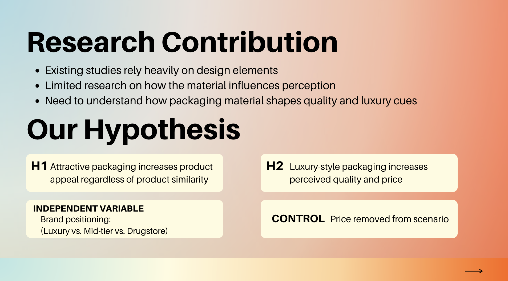
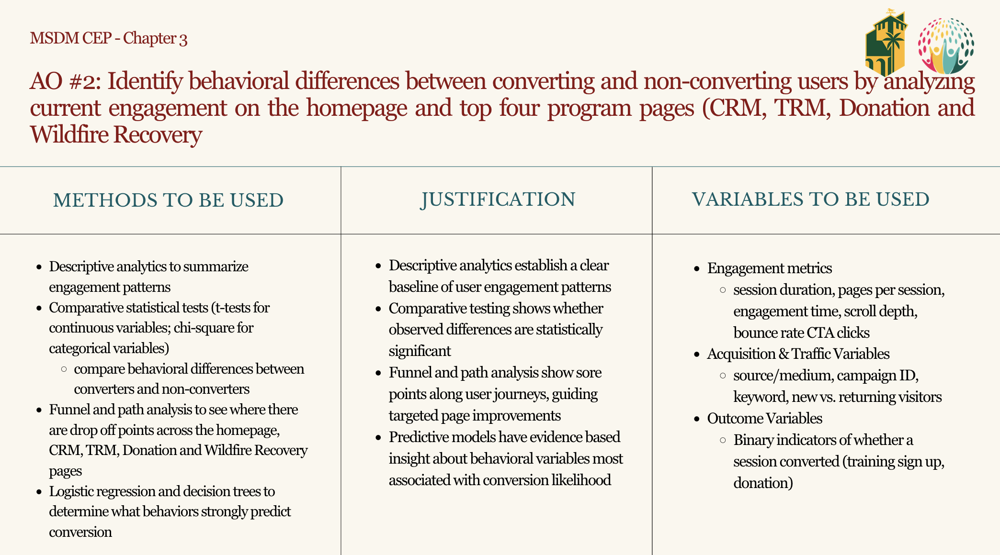
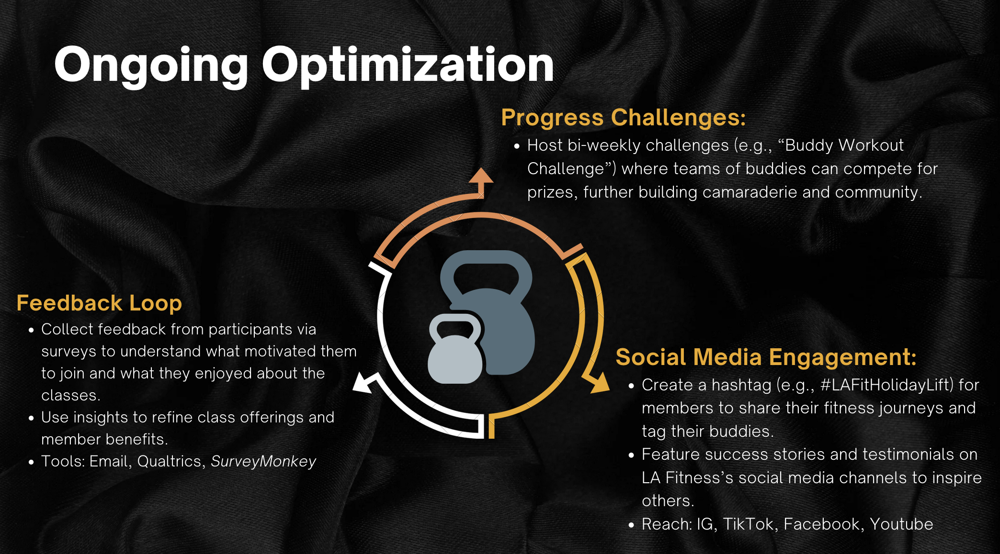

```{=html}
<style>
@import url('https://fonts.googleapis.com/css2?family=Cormorant+Garamond:wght@300;400;600&family=DM+Sans:wght@300;400;500&display=swap');

:root {
  --navy:   #1B4F72;
  --terra:  #E8825A;
  --light:  #F4F7FA;
  --muted:  #7A90A4;
  --white:  #ffffff;
}

.reveal {
  font-family: 'DM Sans', sans-serif;
  color: #1C2B3A;
}

.reveal h1, .reveal h2, .reveal h3 {
  font-family: 'Cormorant Garamond', serif;
  font-weight: 300;
  color: var(--navy);
  text-transform: none;
  letter-spacing: 0.01em;
}

/* ── SLIDE 1: Title ── */
.title-slide-inner {
  display: flex;
  flex-direction: column;
  align-items: center;
  justify-content: center;
  height: 100%;
  gap: 1rem;
}

.title-eyebrow {
  font-size: 0.65rem;
  letter-spacing: 0.22em;
  text-transform: uppercase;
  color: var(--terra);
  font-weight: 400;
}

.title-name {
  font-family: 'Cormorant Garamond', serif;
  font-size: 3.4rem;
  font-weight: 300;
  color: var(--navy);
  margin: 0;
  line-height: 1.1;
}

.title-sub {
  font-size: 0.9rem;
  color: var(--muted);
  font-weight: 300;
  margin: 0;
}

.title-divider {
  width: 48px;
  height: 1.5px;
  background: var(--terra);
  margin: 0.5rem auto;
}

.title-tags {
  display: flex;
  gap: 0.5rem;
  flex-wrap: wrap;
  justify-content: center;
  margin-top: 0.5rem;
}

.title-tag {
  font-size: 0.65rem;
  letter-spacing: 0.1em;
  text-transform: uppercase;
  color: var(--navy);
  border: 0.5px solid rgba(27,79,114,0.3);
  padding: 0.3rem 0.75rem;
  border-radius: 999px;
}

/* ── SLIDE 2: Overview ── */
.overview-grid {
  display: grid;
  grid-template-columns: repeat(3, 1fr);
  gap: 1rem;
  margin-top: 1.5rem;
}

.overview-card {
  background: #EEF5FB;
  border-radius: 12px;
  padding: 1.2rem 1rem;
  text-align: left;
}

.overview-num {
  font-family: 'Cormorant Garamond', serif;
  font-size: 2rem;
  font-weight: 300;
  color: var(--terra);
  line-height: 1;
  margin-bottom: 0.3rem;
}

.overview-label {
  font-size: 0.72rem;
  letter-spacing: 0.1em;
  text-transform: uppercase;
  color: var(--muted);
}

.overview-desc {
  font-size: 0.8rem;
  color: #1C2B3A;
  font-weight: 300;
  margin-top: 0.4rem;
  line-height: 1.5;
}

/* ── PROJECT SLIDES ── */
.project-slide {
  display: grid;
  grid-template-columns: 1fr 1fr;
  gap: 2.5rem;
  align-items: center;
  text-align: left;
  height: 100%;
  padding: 1rem 0;
}

.project-slide.full {
  grid-template-columns: 1fr;
  max-width: 700px;
  margin: 0 auto;
}

.project-left {}

.project-num {
  font-size: 0.62rem;
  letter-spacing: 0.2em;
  text-transform: uppercase;
  color: var(--terra);
  margin-bottom: 0.5rem;
}

.project-title {
  font-family: 'Cormorant Garamond', serif;
  font-size: 2rem;
  font-weight: 300;
  color: var(--navy);
  line-height: 1.2;
  margin: 0 0 1rem 0;
}

.project-desc {
  font-size: 0.85rem;
  color: #4A5568;
  font-weight: 300;
  line-height: 1.7;
  margin-bottom: 1rem;
}

.project-tags {
  display: flex;
  gap: 0.4rem;
  flex-wrap: wrap;
}

.ptag {
  font-size: 0.62rem;
  letter-spacing: 0.1em;
  text-transform: uppercase;
  background: rgba(27,79,114,0.08);
  color: var(--navy);
  padding: 0.25rem 0.65rem;
  border-radius: 999px;
}

.project-right {
  background: #EEF5FB;
  border-radius: 16px;
  padding: 1.5rem;
}

.detail-row {
  margin-bottom: 1rem;
}

.detail-label {
  font-size: 0.6rem;
  letter-spacing: 0.15em;
  text-transform: uppercase;
  color: var(--terra);
  margin-bottom: 0.2rem;
}

.detail-val {
  font-size: 0.82rem;
  color: #1C2B3A;
  font-weight: 300;
  line-height: 1.5;
}

/* ── FINDINGS SLIDE ── */
.findings-grid {
  display: grid;
  grid-template-columns: 1fr 1fr;
  gap: 1rem;
  margin-top: 1rem;
  text-align: left;
}

.finding-card {
  background: #EEF5FB;
  border-radius: 12px;
  padding: 1.2rem;
  border-left: 3px solid var(--terra);
}

.finding-num {
  font-family: 'Cormorant Garamond', serif;
  font-size: 1.6rem;
  color: var(--terra);
  font-weight: 300;
  line-height: 1;
  margin-bottom: 0.4rem;
}

.finding-text {
  font-size: 0.78rem;
  color: #1C2B3A;
  font-weight: 300;
  line-height: 1.6;
}

/* ── CLOSING SLIDE ── */
.closing-inner {
  display: flex;
  flex-direction: column;
  align-items: center;
  justify-content: center;
  gap: 1rem;
}

.closing-quote {
  font-family: 'Cormorant Garamond', serif;
  font-size: 1.6rem;
  font-weight: 300;
  color: var(--navy);
  max-width: 560px;
  line-height: 1.5;
  font-style: italic;
}

.closing-contact {
  font-size: 0.78rem;
  color: var(--muted);
  letter-spacing: 0.08em;
}

/* ── SECTION LABEL ── */
.section-label {
  font-size: 0.62rem;
  letter-spacing: 0.2em;
  text-transform: uppercase;
  color: var(--terra);
  margin-bottom: 0.6rem;
}

.slide-h2 {
  font-family: 'Cormorant Garamond', serif;
  font-size: 2rem;
  font-weight: 300;
  color: var(--navy);
  margin: 0 0 0.3rem;
}

.slide-sub {
  font-size: 0.8rem;
  color: var(--muted);
  font-weight: 300;
  margin-bottom: 1.2rem;
}
</style>
```

##  {background-color="#F4F7FA"}

```{=html}
<div class="title-slide-inner">
  <p class="title-eyebrow">Digital Marketing Portfolio</p>
  <h1 class="title-name">Shayah Lacour</h1>
  <p style="font-family:'Cormorant Garamond',serif; font-size:1.3rem; font-weight:300; color:var(--terra); letter-spacing:0.08em; margin:0;">Portfolio Presentation</p>
  <div class="title-divider"></div>
  <p class="title-sub">MS Digital Marketing · Cal Poly Pomona</p>
  <div class="title-tags">
    <span class="title-tag">GA4 Analytics</span>
    <span class="title-tag">Consumer Research</span>
    <span class="title-tag">Campaign Strategy</span>
    <span class="title-tag">Social Media</span>
  </div>
</div>
```

##  {background-color="#F4F7FA"}

```{=html}
<div class="section-label">At a Glance</div>
<h2 class="slide-h2">Highlighted Projects.</h2>

<div class="overview-grid">
  <div class="overview-card">
    <div class="overview-num">01</div>
    <div class="overview-label">AI Research</div>
    <div class="overview-desc">ChatGPT persona development for Rare Beauty</div>
  </div>
  <div class="overview-card">
    <div class="overview-num">02</div>
    <div class="overview-label">Consumer Survey</div>
    <div class="overview-desc">How packaging shapes purchasing decisions</div>
  </div>
  <div class="overview-card">
    <div class="overview-num">03</div>
    <div class="overview-label">Capstone</div>
    <div class="overview-desc">GA4 attribution analysis for TRI</div>
  </div>
  <div class="overview-card">
    <div class="overview-num">04</div>
    <div class="overview-label">Mock Campaign</div>
    <div class="overview-desc">LA Fitness holiday buddy pass campaign</div>
  </div>
  <div class="overview-card">
    <div class="overview-num">05</div>
    <div class="overview-label">Social Strategy</div>
    <div class="overview-desc">Brand humor vs. crisis communication</div>
  </div>
  
```

##  {background-color="#F4F7FA"}

```{=html}
<div class="project-slide">
  <div class="project-left">
    <div class="project-num">Project 01 · AI Research</div>
    <h2 class="project-title">ChatGPT Persona Development for Rare Beauty</h2>
    <p class="project-desc">Used ChatGPT to build a detailed customer persona for Rare Beauty, exploring how generative AI can accelerate consumer insight work in brand strategy.</p>
    <div class="project-tags">
      <span class="ptag">ChatGPT</span>
      <span class="ptag">Persona Development</span>
      <span class="ptag">Brand Strategy</span>
    </div>
  </div>
  <div class="project-right">
  <div class="project-right" style="padding:0;overflow:hidden;">
  
</div>
    </div>
    <div class="detail-row">
      <div class="detail-label">Objective</div>
      <div class="detail-val">Develop a research-backed customer persona using AI to understand the core Rare Beauty buyer</div>
    </div>
    <div class="detail-row">
      <div class="detail-label">Method</div>
      <div class="detail-val">Iterative ChatGPT prompting, persona framework design, insight synthesis</div>
    </div>
    <div class="detail-row" style="margin-bottom:0">
      <div class="detail-label">Key Takeaway</div>
      <div class="detail-val">AI tools can meaningfully accelerate persona research when paired with strategic prompting</div>
    </div>
  </div>
</div>
```

##  {background-color="#F4F7FA"}

```{=html}
<div class="project-slide">
  <div class="project-left">
    <div class="project-num">Project 02 · Consumer Research</div>
    <h2 class="project-title">Packaging & Purchase Decision Survey</h2>
    <p class="project-desc">Collaborated with a team to design and field a survey examining how product packaging influences consumer buying behavior — from first impression to final purchase.</p>
    <div class="project-tags">
      <span class="ptag">Survey Design</span>
      <span class="ptag">Consumer Behavior</span>
      <span class="ptag">Team Research</span>
    </div>
  </div>
  <div class="project-right">
   <div class="project-right" style="padding:0;overflow:hidden;">
  
</div>
    </div>
    <div class="detail-row">
      <div class="detail-label">Method</div>
      <div class="detail-val">Team-designed survey instrument, quantitative response analysis</div>
    </div>
    <div class="detail-row">
      <div class="detail-label">Skills Applied</div>
      <div class="detail-val">Survey methodology, question design, collaborative research, data interpretation</div>
    </div>
    <div class="detail-row" style="margin-bottom:0">
      <div class="detail-label">Key Takeaway</div>
      <div class="detail-val">Packaging is a silent salesperson — visual cues significantly affect purchase intent</div>
    </div>
  </div>
</div>
```

##  {background-color="#F4F7FA"}

```{=html}
<div class="project-slide">
  <div class="project-left">
    <div class="project-num">Project 03 · Capstone</div>
    <h2 class="project-title">TRI Multi-Channel Attribution Analysis</h2>
    <p class="project-desc">Year-long capstone project with the Trauma Resource Institute — using GA4, BigQuery, and Markov Chain models to identify which digital channels drive conversions.</p>
    <div class="project-tags">
      <span class="ptag">GA4</span>
      <span class="ptag">BigQuery</span>
      <span class="ptag">Markov Chain</span>
      <span class="ptag">Shapley Values</span>
      <span class="ptag">R</span>
    </div>
  </div>
  <div class="project-right">
    <div class="project-right" style="padding:0;overflow:hidden;">
  
</div>
    <div class="detail-row">
      <div class="detail-label">Approach</div>
      <div class="detail-val">Markov Chain attribution, Shapley value fairness checks, path length analysis</div>
    </div>
    <div class="detail-row">
      <div class="detail-label">Finding</div>
      <div class="detail-val">All 4 channels contribute equally (~20–22 credits each); longer journeys convert better</div>
    </div>
    <div class="detail-row" style="margin-bottom:0">
      <div class="detail-label">Recommendation</div>
      <div class="detail-val">Use Markov as primary attribution model; invest across all channels, not just last-touch</div>
    </div>
  </div>
</div>
```

##  {background-color="#F4F7FA"}

```{=html}
<div class="project-slide">
  <div class="project-left">
    <div class="project-num">Project 04 · Campaign Strategy</div>
    <h2 class="project-title">LA Fitness Holiday Buddy Pass Campaign</h2>
    <p class="project-desc">Developed a mock holiday campaign for LA Fitness targeting existing members with a seasonal deal centered around a buddy pass — blending retention and referral strategy.</p>
    <div class="project-tags">
      <span class="ptag">Campaign Design</span>
      <span class="ptag">Retention Marketing</span>
      <span class="ptag">Referral Strategy</span>
    </div>
  </div>
  <div class="project-right">
    <div class="detail-row">
     <div class="project-right" style="padding:0;overflow:hidden;">
  
</div>
    <div class="detail-row">
      <div class="detail-label">Objective</div>
      <div class="detail-val">Re-engage existing members during the holiday season and drive referrals through a buddy pass promotion</div>
    </div>
    <div class="detail-row">
      <div class="detail-label">Strategy</div>
      <div class="detail-val">Holiday urgency + social proof + dual incentive (member reward + friend access)</div>
    </div>
    <div class="detail-row" style="margin-bottom:0">
      <div class="detail-label">Key Takeaway</div>
      <div class="detail-val">Retention campaigns with referral hooks outperform pure acquisition messaging</div>
    </div>
  </div>
</div>
```

##  {background-color="#F4F7FA"}

```{=html}
<div class="project-slide">
  <div class="project-left">
    <div class="project-num">Project 05 · Social Media Strategy</div>
    <h2 class="project-title">Brand Humor in Crisis — Where's the Line?</h2>
    <p class="project-desc">Strategic analysis inspired by a real article exploring when brands can use humor publicly and when a crisis demands a more measured, serious response.</p>
    <div class="project-tags">
      <span class="ptag">Social Media Strategy</span>
      <span class="ptag">Brand Voice</span>
      <span class="ptag">Crisis Comms</span>
    </div>
  </div>
  <div class="project-right">
    <div class="detail-row">
      <div class="detail-label">Trigger</div>
      <div class="detail-val">Article examining the appropriateness of humor when a brand faces public criticism</div>
    </div>
    <div class="detail-row">
      <div class="detail-label">Framework</div>
      <div class="detail-val">Mapped brand scenarios across a humor-appropriateness spectrum with decision criteria</div>
    </div>
    <div class="detail-row">
      <div class="detail-label">Skills Applied</div>
      <div class="detail-val">Social strategy, brand tone analysis, crisis communication frameworks</div>
    </div>
    <div class="detail-row" style="margin-bottom:0">
      <div class="detail-label">Key Takeaway</div>
      <div class="detail-val">Humor builds brand equity — but context, timing, and audience trust determine when it's a risk</div>
    </div>
  </div>
</div>
```

##  {background-color="#1B4F72"}

```{=html}
<div class="closing-inner">
  <p style="font-size:0.62rem;letter-spacing:0.22em;text-transform:uppercase;color:var(--terra);">Thank You</p>
  <p class="closing-quote" style="color:#ffffff;">"Data tells you what happened. Strategy decides what to do next."</p>
  <div class="title-divider"></div>
  <p class="closing-contact" style="color:rgba(255,255,255,0.5);">Shayah Lacour · MS Digital Marketing · Cal Poly Pomona</p>
  <div style="display:flex;gap:0.5rem;margin-top:0.5rem;flex-wrap:wrap;justify-content:center;">
    <span class="title-tag" style="color:rgba(255,255,255,0.7);border-color:rgba(255,255,255,0.2);">GA4 Analytics</span>
    <span class="title-tag" style="color:rgba(255,255,255,0.7);border-color:rgba(255,255,255,0.2);">Consumer Research</span>
    <span class="title-tag" style="color:rgba(255,255,255,0.7);border-color:rgba(255,255,255,0.2);">Campaign Strategy</span>
    <span class="title-tag" style="color:rgba(255,255,255,0.7);border-color:rgba(255,255,255,0.2);">Social Media</span>
  </div>
</div>
```
