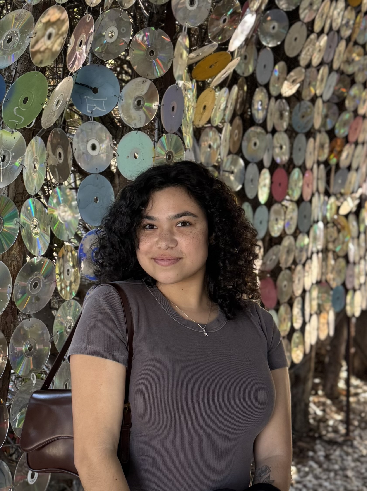

::: {.columns}
::: {.column width="25%"}
{style="border-radius: 50%; width: 100%; aspect-ratio: 1; object-fit: cover"}
:::
::: {.column width="75%" style="padding-left: 2rem;"}
I'm a digital marketing student focused on brand strategy, web analytics,
and audience insights. My work blends creative marketing thinking with
data-informed decision making.
:::
:::

## About Me

I am currently pursuing a **Master of Science in Digital Marketing** at California State Polytechnic University, Pomona (expected August 2026). I hold a B.A. in Sociology from UCLA (2021) and bring a unique blend of skills in SEO, GA4 analytics, R, and data visualization to every project.

## What I Do

- **Web Analytics:** Tracking and interpreting GA4 data to understand
  audience behavior and optimize digital experiences.
- **SEO Strategy:** Conducting audits and keyword research to improve
  organic visibility for real and mock clients.
- **Digital Campaigns:** Building and analyzing campaigns across social
  media, email, and paid media channels.
- **Data Visualization:** Turning raw marketing data into clear,
  compelling stories using R and Quarto.

## Let's Connect

You can [email me](mailto:slacour@cpp.edu) or connect on
[LinkedIn](https://www.linkedin.com/in/shayah-lacour).

---
*Welcome to my portfolio.*