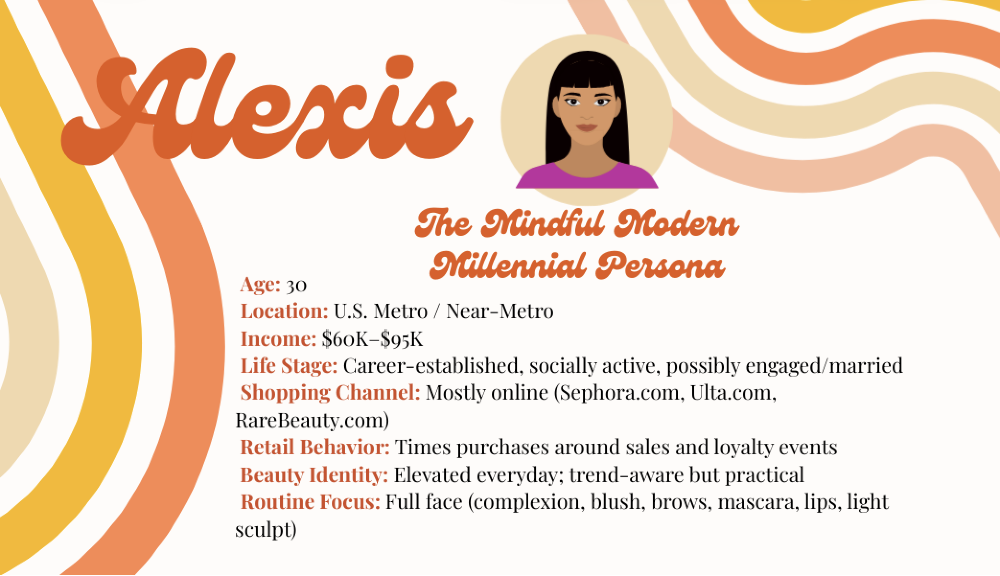
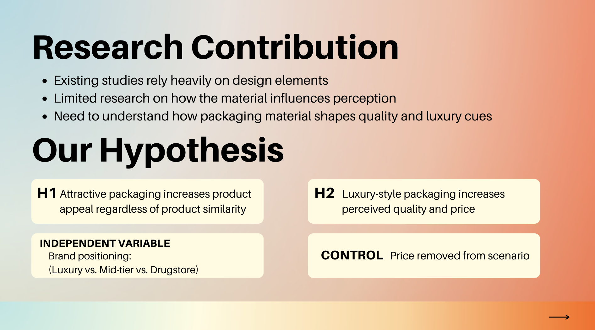
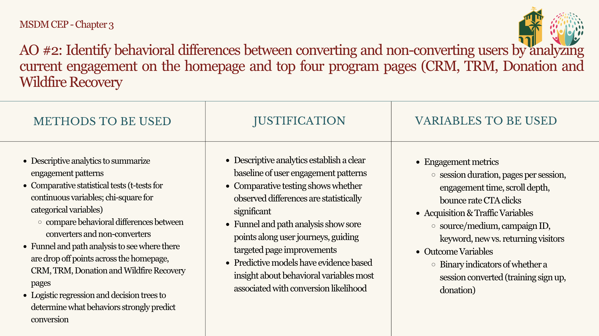
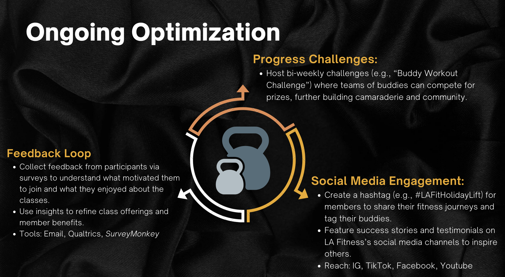

```{=html}
<style>
@import url('https://fonts.googleapis.com/css2?family=Cormorant+Garamond:ital,wght@0,300;0,400;1,300&family=DM+Sans:wght@300;400&display=swap');

:root {
  --navy:  #1B4F72;
  --terra: #E8825A;
  --light: #F4F7FA;
  --muted: #7A90A4;
  --card:  #EEF5FB;
}

.reveal, .reveal p, .reveal li { font-family:'DM Sans',sans-serif; font-weight:300; color:#1C2B3A; }
.reveal h1,.reveal h2,.reveal h3 { font-family:'Cormorant Garamond',serif; font-weight:300; color:var(--navy); text-transform:none; letter-spacing:0.01em; line-height:1.15; margin:0; }
.reveal section { padding:0!important; height:720px!important; box-sizing:border-box; overflow:hidden!important; }

/* TITLE */
.title-wrap { width:100%; height:720px; background:var(--light); display:flex; flex-direction:column; align-items:center; justify-content:center; gap:12px; box-sizing:border-box; overflow:hidden; }
.t-eyebrow { font-size:.85rem; letter-spacing:.22em; text-transform:uppercase; color:var(--terra); }
.t-name { font-family:'Cormorant Garamond',serif; font-size:5rem; font-weight:300; color:var(--navy); line-height:1; margin:0; }
.t-pres { font-family:'Cormorant Garamond',serif; font-size:1.7rem; font-weight:300; color:var(--terra); letter-spacing:.1em; font-style:italic; }
.t-divider { width:48px; height:1.5px; background:var(--terra); margin:4px 0; }
.t-sub { font-size:1.05rem; color:var(--muted); font-weight:300; }
.t-tags { display:flex; gap:8px; flex-wrap:wrap; justify-content:center; margin-top:8px; }
.t-tag { font-size:.8rem; letter-spacing:.1em; text-transform:uppercase; color:var(--navy); border:.5px solid rgba(27,79,114,.3); padding:4px 14px; border-radius:999px; }

/* OVERVIEW */
.slide-wrap { width:100%; height:720px; box-sizing:border-box; background:var(--light); overflow:hidden; display:flex; flex-direction:column; padding:48px 64px; }
.ov-eyebrow { font-size:.8rem; letter-spacing:.2em; text-transform:uppercase; color:var(--terra); margin-bottom:6px; }
.ov-title { font-family:'Cormorant Garamond',serif; font-size:2.8rem; font-weight:300; color:var(--navy); margin-bottom:24px; }
.ov-grid { display:grid; grid-template-columns:repeat(3,1fr); gap:14px; flex:1; align-content:start; }
.ov-card { background:white; border-radius:12px; padding:20px; display:flex; flex-direction:column; gap:6px; align-self: start; }
.ov-num { font-family:'Cormorant Garamond',serif; font-size:1.8rem; font-weight:300; color:var(--terra); line-height:1; }
.ov-label { font-size:.68rem; letter-spacing:.12em; text-transform:uppercase; color:var(--muted); }
.ov-desc { font-size:1.1rem; color:#1C2B3A; font-weight:300; line-height:1.5; margin-top:4px; }

/* PROJECT */
.proj-wrap { width:100%; height:720px; background:var(--light); display:grid; grid-template-columns:1fr 1fr; box-sizing:border-box; overflow:hidden; }
.proj-left { padding:52px 40px 52px 64px; display:flex; flex-direction:column; justify-content:center; overflow:hidden; }
.proj-num { font-size:.75rem; letter-spacing:.2em; text-transform:uppercase; color:var(--terra); margin-bottom:10px; }
.proj-title { font-family:'Cormorant Garamond',serif; font-size:1.9rem; font-weight:300; color:var(--navy); line-height:1.2; margin-bottom:12px; }
.proj-desc { font-size:1.2rem; color:#4A5568; font-weight:300; line-height:1.7; margin-bottom:12px; }
.proj-tags { display:flex; gap:6px; flex-wrap:wrap; margin-bottom:18px; }
.ptag { font-size:.58rem; letter-spacing:.1em; text-transform:uppercase; background:rgba(27,79,114,.08); color:var(--navy); padding:3px 10px; border-radius:999px; }
.proj-details { display:flex; flex-direction:column; gap:12px; }
.pdl { font-size:.72rem; letter-spacing:.15em; text-transform:uppercase; color:var(--terra); margin-bottom:2px; margin-top:0; }
.pdv { font-size:.95rem; color:#1C2B3A; font-weight:300; line-height:1.5; margin:0; }

/* RIGHT PANELS */
.proj-right-img { 
  overflow:hidden; 
  display:flex; 
  align-items:center; 
  justify-content:center;
  padding: 40px 48px 40px 24px;
  box-sizing: border-box;
}
.proj-right-img img { 
  width:100%; 
  height:100%; 
  max-height: 580px;
  object-fit:contain; 
  object-position:center;
  border-radius: 12px;
  display:block; 
}
.proj-right-info { background:white; margin:40px 48px 40px 0; border-radius:16px; padding:32px; display:flex; flex-direction:column; gap:16px; overflow:hidden; }

/* CLOSING */
.closing-wrap { width:100%; height:720px; background:var(--navy); display:flex; flex-direction:column; align-items:center; justify-content:center; gap:16px; box-sizing:border-box; overflow:hidden; }
.c-eyebrow { font-size:.6rem; letter-spacing:.22em; text-transform:uppercase; color:var(--terra); }
.c-quote { font-family:'Cormorant Garamond',serif; font-size:1.7rem; font-weight:300; font-style:italic; color:white; max-width:580px; text-align:center; line-height:1.5; }
.c-divider { width:48px; height:1.5px; background:var(--terra); }
.c-name { font-size:.78rem; color:rgba(255,255,255,.5); letter-spacing:.08em; }
.c-tags { display:flex; gap:8px; flex-wrap:wrap; justify-content:center; }
.c-tag { font-size:.58rem; letter-spacing:.1em; text-transform:uppercase; color:rgba(255,255,255,.6); border:.5px solid rgba(255,255,255,.2); padding:4px 14px; border-radius:999px; }
</style>
```


```{=html}
<div class="title-wrap">
  <p class="t-eyebrow">Digital Marketing Portfolio</p>
  <h1 class="t-name">Shayah LaCour</h1>
  <p class="t-pres">Portfolio Presentation</p>
  <div class="t-divider"></div>
  <p class="t-sub">MS Digital Marketing · Cal Poly Pomona</p>
  <div class="t-tags">
    <span class="t-tag">GA4 Analytics</span>
    <span class="t-tag">Consumer Research</span>
    <span class="t-tag">Campaign Strategy</span>
    <span class="t-tag">Social Media</span>
  </div>
</div>
```

---

## {background-color="#F4F7FA"}

```{=html}
<div class="slide-wrap">
  <p class="ov-eyebrow">At a Glance</p>
  <h2 class="ov-title">Cal Poly Pomona Project Highlights.</h2>
  <div class="ov-grid">
    <div class="ov-card">
      <div class="ov-num">1</div>
      <div class="ov-label">AI Research</div>
      <div class="ov-desc">ChatGPT persona development for Rare Beauty</div>
    </div>
    <div class="ov-card">
      <div class="ov-num">2</div>
      <div class="ov-label">Qualtrics Survey</div>
      <div class="ov-desc">How packaging shapes purchasing decisions</div>
    </div>
    <div class="ov-card">
      <div class="ov-num">3</div>
      <div class="ov-label">Capstone Project</div>
      <div class="ov-desc">Google Analytics and Big Query research for the Trauma Resource Institute</div>
    </div>
    <div class="ov-card">
      <div class="ov-num">4</div>
      <div class="ov-label">Mock Campaign</div>
      <div class="ov-desc">LA Fitness holiday buddy pass campaign</div>
    </div>
    <div class="ov-card">
      <div class="ov-num">5</div>
      <div class="ov-label">Social Strategy</div>
      <div class="ov-desc">Brand humor vs. crisis communication</div>
  </div>
</div>
```

---

## {background-color="#F4F7FA"}

```{=html}
<div class="proj-wrap">
  <div class="proj-left">
    <p class="proj-num">Project 1 · AI Research</p>
    <h2 class="proj-title">ChatGPT Persona Development for Rare Beauty</h2>
    <p class="proj-desc">Used ChatGPT to build a detailed customer persona for Rare Beauty, exploring how generative AI can accelerate consumer insight work in brand strategy.</p>
    <div class="proj-tags">
      <span class="ptag">ChatGPT</span>
      <span class="ptag">Persona Development</span>
      <span class="ptag">Brand Strategy</span>
    </div>
    <div class="proj-details">
      <div><p class="pdl">Objective</p><p class="pdv">Develop a research-backed customer persona using AI for the brand of my choosing, which ended up being Rare Beauty.</p></div>
      <div><p class="pdl">Method</p><p class="pdv">Iterative ChatGPT prompting, persona framework design, research on Rare Beauty's current target audience</p></div>
      <div><p class="pdl">Key Takeaway</p><p class="pdv">AI tools can meaningfully accelerate persona research when paired with strategic prompting and research</p></div>
    </div>
  </div>
  <div class="proj-right-img">
    
  </div>
</div>
```

---

## {background-color="#F4F7FA"}

```{=html}
<div class="proj-wrap">
  <div class="proj-left">
    <p class="proj-num">Project 2 · Qualtrics Survey</p>
    <h2 class="proj-title">Packaging & Purchase Decision Survey</h2>
    <p class="proj-desc">Collaborated with a team to design and field a survey examining how product packaging influences consumer buying behavior — from first impression to final purchase.</p>
    <div class="proj-tags">
      <span class="ptag">Survey Design</span>
      <span class="ptag">Consumer Behavior</span>
      <span class="ptag">Team Research</span>
    </div>
    <div class="proj-details">
      <div><p class="pdl">Method</p><p class="pdv">Team-designed survey in Qualtrics, quantitative response analysis</p></div>
      <div><p class="pdl">Skills Applied</p><p class="pdv">Survey methodology, question design, collaborative research, data interpretation</p></div>
      <div><p class="pdl">Key Takeaway</p><p class="pdv">There were some surprises with the surveyors believing high end was the drug store brand.</p></div>
    </div>
  </div>
  <div class="proj-right-img">
    
  </div>
</div>
```

---

## {background-color="#F4F7FA"}

```{=html}
<div class="proj-wrap">
  <div class="proj-left">
    <p class="proj-num">Project 3 · Capstone</p>
    <h2 class="proj-title">TRI Multi-Channel Attribution Analysis</h2>
    <p class="proj-desc">Year-long capstone with the Trauma Resource Institute — using GA4, BigQuery, and Markov Chain models to understand behavioral differences between converters and non-converters.</p>
    <div class="proj-tags">
      <span class="ptag">GA4</span>
      <span class="ptag">BigQuery</span>
      <span class="ptag">Markov Chain</span>
      <span class="ptag">Shapley Values</span>
      <span class="ptag">R</span>
    </div>
    <div class="proj-details">
      <div><p class="pdl">Problem</p><p class="pdv">Users visited TRI's site but rarely converted to sign-ups or donations</p></div>
      <div><p class="pdl">Finding</p><p class="pdv"> Converters are more likely to have a longer journey and non-converters are not staying or exploring the pages for long.</p></div>
      <div><p class="pdl">Recommendation</p><p class="pdv">Work on making the user journey simpler, many of TRI's pages had information deep within the page.</p></div>
    </div>
  </div>
  <div class="proj-right-img">
    
  </div>
</div>
```

---

## {background-color="#F4F7FA"}

```{=html}
<div class="proj-wrap">
  <div class="proj-left">
    <p class="proj-num">Project 4 · Mock Campaign</p>
    <h2 class="proj-title">LA Fitness Holiday Buddy Pass Campaign</h2>
    <p class="proj-desc">In class, my team was given a prompt of a mock holiday campaign for LA Fitness and incorporating their buddy passes. The target audience was the buddy and to encourage them to sign up for a membership.</p>
    <div class="proj-tags">
      <span class="ptag">Campaign Design</span>
      <span class="ptag">Retention Marketing</span>
      <span class="ptag">Referral Strategy</span>
    </div>
    <div class="proj-details">
      <div><p class="pdl">Strategy</p><p class="pdv">Holiday urgency + social proof + dual incentive (member reward + friend access)</p></div>
      <div><p class="pdl">Channels</p><p class="pdv">Instagram, TikTok  · #LAFitHolidayLift</p></div>
      <div><p class="pdl">Key Takeaway</p><p class="pdv">Understanding the necessity for ongoing optimization and social media presence. </p></div>
    </div>
  </div>
  <div class="proj-right-img">
    
  </div>
</div>
```

---

## {background-color="#F4F7FA"}

```{=html}
<div class="proj-wrap">
  <div class="proj-left">
    <p class="proj-num">Project 5 · Social Media Strategy</p>
    <h2 class="proj-title">Brand Humor in Crisis — Where's the Line?</h2>
    <p class="proj-desc">From an article, "Bunch of jerks: How brands can benefit by reappropriating insults" by Katherine M. Du, Keisha M. Cutright and Lingrui Zhou, my group assessed where it was appropriate to use humor in brand awareness. </p>
    <div class="proj-tags">
      <span class="ptag">Social Media Strategy</span>
      <span class="ptag">Brand Voice</span>
      <span class="ptag">Crisis Comms</span>
    </div>
    <div class="proj-details">
      <div><p class="pdl">Framework</p><p class="pdv">Included real promotions, such as e.l.f beauty and the NFL, in order to include real life scenarios </p></div>
      <div><p class="pdl">Skills Applied</p><p class="pdv">Social strategy, brand tone analysis, crisis communication frameworks</p></div>
      <div><p class="pdl">Key Takeaway</p><p class="pdv">Humor builds brand equity, but context, timing, and audience trust determine when it's a risk</p></div>
    </div>
  </div>
  <div class="proj-right-info">
    <div style="background:var(--card);border-radius:10px;padding:18px;">
      <p class="pdl" style="margin-bottom:6px;">When humor works</p>
      <p class="pdv">Brand not directly at fault · Audience has positive sentiment · Issue is lighthearted in nature</p>
    </div>
    <div style="background:var(--card);border-radius:10px;padding:18px;">
      <p class="pdl" style="margin-bottom:6px;">When to stay serious</p>
      <p class="pdv">Direct harm or controversy · Public trust is at stake · Audience is emotionally invested</p>
    </div>
    <div style="background:var(--navy);border-radius:10px;padding:18px;">
      <p class="pdl" style="color:var(--terra);margin-bottom:6px;">The takeaway</p>
      <p class="pdv" style="color:rgba(255,255,255,.85);">Be cautious, understand where the line is before making a joke.</p>
    </div>
  </div>
</div>
```

